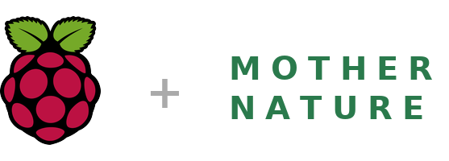
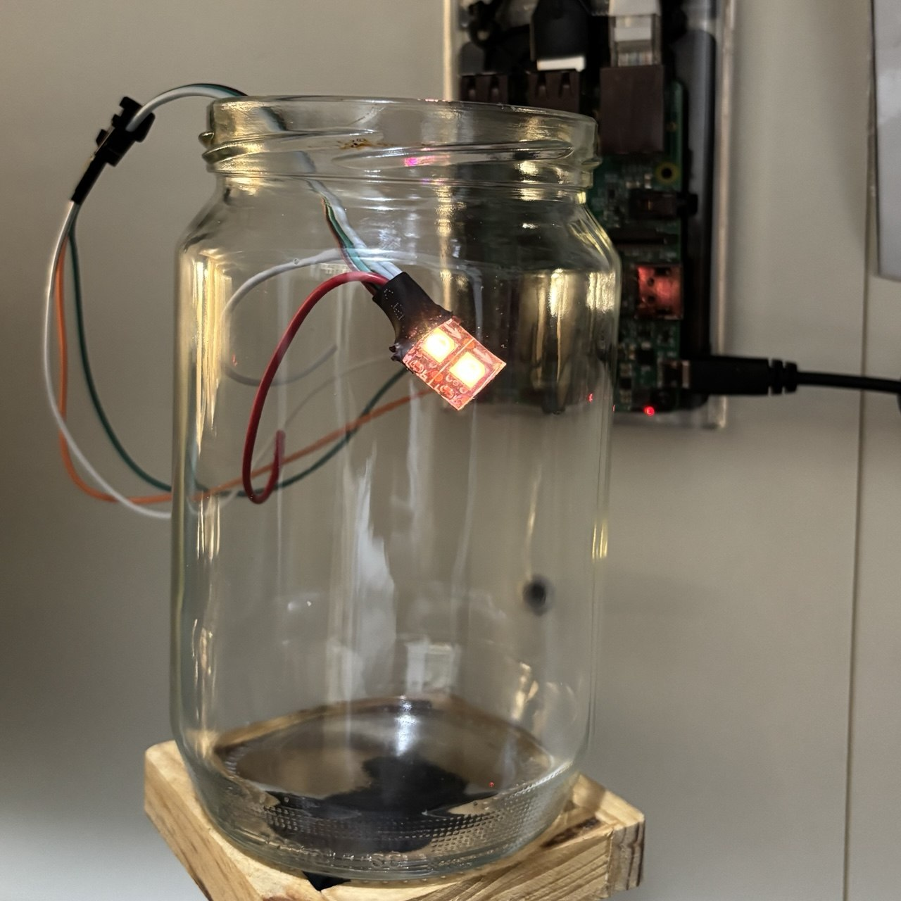
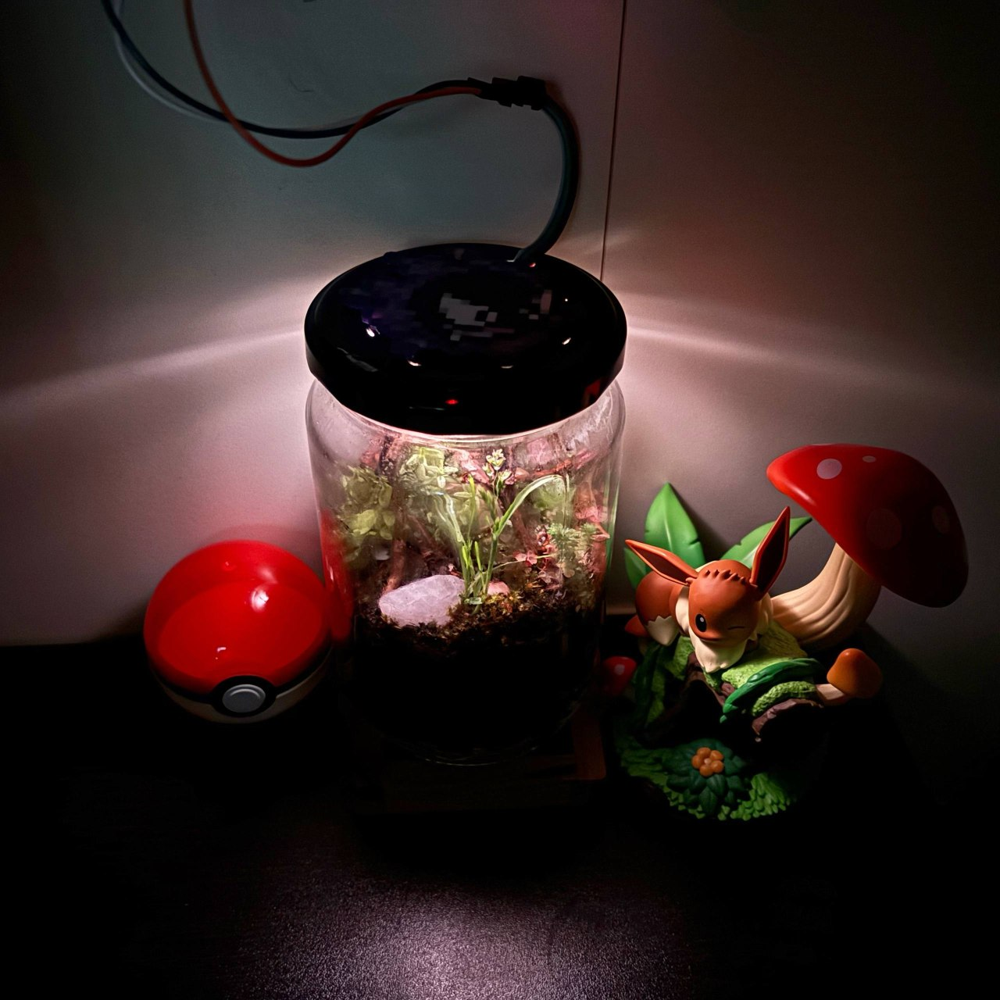
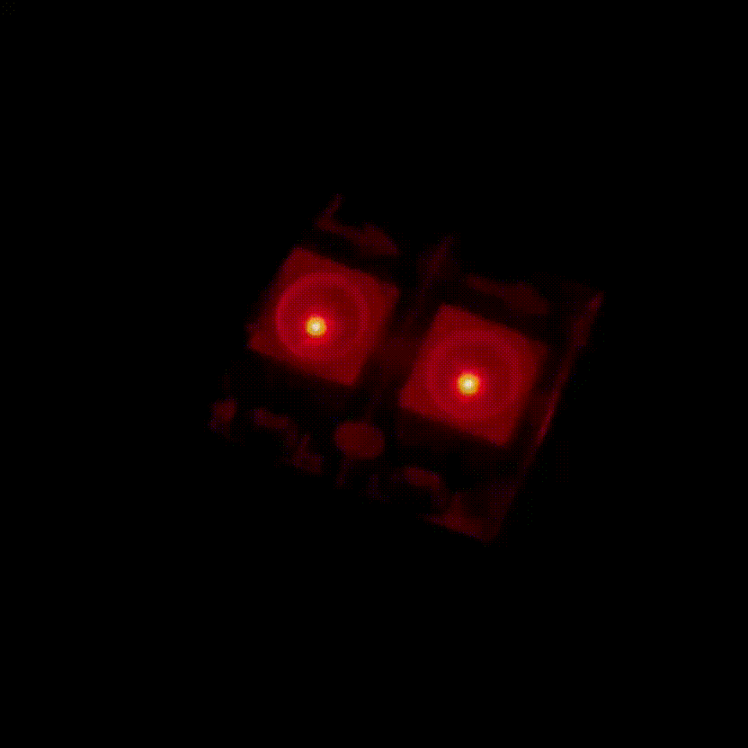
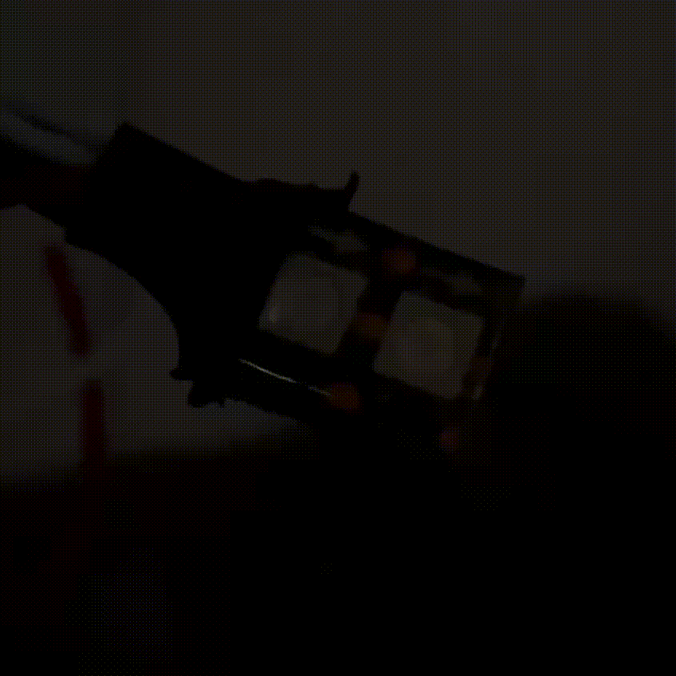
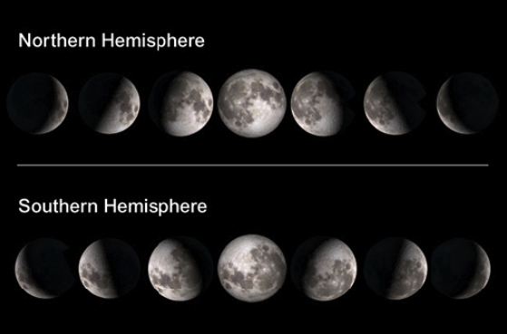
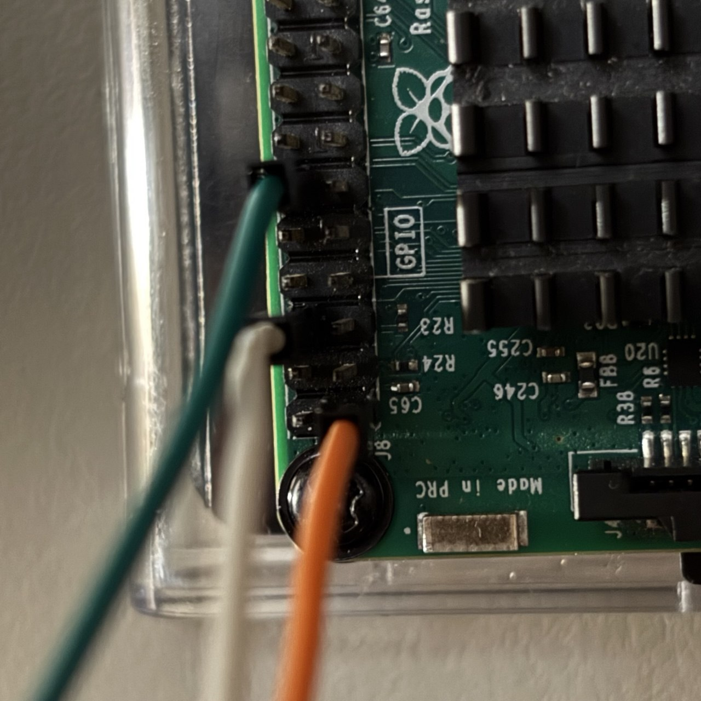

<p align="center">
  
</p>

<p align="center">
  
</p>

<p align="center">
  <em>A tiny self-contained terrarium paired with a Raspberry&nbsp;Pi lighting system<br>
  that simulates a full day/night cycle and the phases of the&nbsp;moon.</em>
</p>

<p align="center">
  
  
</p>

---

A minimal lighting system using a Raspberry Pi and two WS2812 LEDs.
_(update! Added 96 light steps and 3 levels of brightness)_

This project simulates:

- a real daylight cycle (sunrise, noon, sunset)
- real moon phases during the night
- a smooth 24-hour light progression using 96 time steps

---

## 🫙 Terrarium build guide

The full step-by-step guide on how to build the physical terrarium is **live** here:

### 👉 **[mommotti.github.io/raspberrarium-site](https://mommotti.github.io/raspberrarium-site/)**

The guide covers the jar, the layered substrate, the lid with ventilation and watering holes, and how the LEDs are mounted and diffused inside the enclosure.

---

## Scope of the project

This project is designed for **small-scale containers**.

The container can be anything:

- a glass jar
- a small terrarium
- any enclosed decorative space

Because of this, the focus of the project is **only on lighting simulation**.

This repository does **not** cover:

- how to build a terrarium. Please check my [Raspberrarium build guide](https://mommotti.github.io/raspberrarium-site/)
- how to design the container
- plant selection or environmental control

The goal is simply to provide a clean, minimal system to simulate natural light inside a small space.

---

## Size reference

The example build shown here uses a small jar:

- Diameter: 8 cm (≈ 3.15 inches)
- Height: 13 cm (≈ 5.1 inches)

This scale is important because the lighting is tuned for **very small enclosed spaces**.

---

## Concept

The system uses only **two LEDs**, mapped as:

- LED 0 → left side
- LED 1 → right side

This allows a simple but effective representation of the moon:

- waxing phases → brighter on the right
- waning phases → brighter on the left
- full moon → both LEDs on
- new moon → off

The daylight cycle is divided into **96 steps per day** (one every 15 minutes), creating a smooth transition between all phases of the day.

> The build guide on [mommotti.github.io/raspberrarium-site](https://mommotti.github.io/raspberrarium-site/) shows how the two LEDs look once mounted and diffused inside the jar.

---

## Demo

### Day / Night cycle

<p align="center">
  
</p>

_The GIF is a sped-up demo made from a shortened version of the code for illustration; the real code runs the full 96-step cycle over 24 hours._

### Moon phases

<p align="center">
  
</p>

_The GIF is also a sped-up demo; in the actual build each phase lasts around a week, following the real lunar cycle._

---

## See it in action

<p align="center">
  
</p>

_The day/night demo script running on the real hardware inside the jar._

---

## Hemisphere note

<p align="center">
  
</p>

This project keeps the logic simple.

- LED 0 is always treated as the left side
- LED 1 is always treated as the right side

If you are in the southern hemisphere, simply rotate the container/LED.

---

## Wiring

<p align="center">
  
</p>

Raspberry Pi 3B+:

- Pin 1 (3.3V) or Pin 2 (5V)
- Pin 6 (GND)
- Pin 12

---

## Features

- 96-step daily light cycle (smooth transitions)
- Real sunrise and sunset based on location
- Moon phase simulation using two LEDs
- Adjustable global brightness (levels 1–3)
- Optional silent mode (no console output)
- Automatic daily recalculation of sun and moon data

---

## Requirements

Install dependencies:

```bash
sudo pip3 install adafruit-blinka adafruit-circuitpython-neopixel rpi_ws281x astral python-dotenv --break-system-packages
```

---

## Get the project

Clone the repository on your Raspberry Pi:

```bash
git clone https://github.com/mommotti/raspberrarium.git
cd raspberrarium
```

This will create a folder:

```text
/home/YOUR_USERNAME/raspberrarium/
```

Your main script will be located at:

```text
/home/YOUR_USERNAME/raspberrarium/raspberrarium.py
```

---

## Set your location

Before running the script, create a `.env` file in the project folder and set your timezone and coordinates. The sunrise, sunset, and moon phase calculations depend on these values.

```bash
sudo nano /home/YOUR_USERNAME/raspberrarium/.env
```

Then add the following:

```env
TIMEZONE=Europe/Rome
LATITUDE=00.00
LONGITUDE=00.00
```

- **TIMEZONE**: must follow IANA format (e.g. `Europe/Rome`, `America/New_York`). Full list: [tz database time zones](https://en.wikipedia.org/wiki/List_of_tz_database_time_zones)
- **LATITUDE / LONGITUDE**: find yours on [Google Maps](https://www.google.com/maps) (right-click → "What's here?")

---

## Run

Run the main script:

```bash
sudo python3 raspberrarium.py --brightness 3 --silent
```

- `--brightness` sets the brightness level (1 = lowest, 3 = highest)  
- `--silent` disables console logs (optional, remove it if you want logs)

*Note: At lower brightness levels (1–2), the LEDs may appear off during certain phases.*

---

## Run the demos

You can use the demo scripts to quickly test the LEDs and compare brightness levels (1,2,3).

The day/night demo cycles through lighting states and ends with a full moon baseline (both LEDs on):

```bash
sudo python3 demo/demo_day_night.py --brightness 3
```

The moon demo cycles through all moon phases:

```bash
sudo python3 demo/demo_moon_phase.py --brightness 3
```

---

## Optional: run automatically on boot and restart on crash

### 1. Create the service file

```bash
sudo nano /etc/systemd/system/raspberrarium.service
```

### 2. Paste this

```ini
[Unit]
Description=Raspberrarium Lighting System
After=network.target

[Service]
ExecStart=/usr/bin/python3 /home/YOUR_USERNAME_HERE/raspberrarium/raspberrarium.py --silent --brightness 3
WorkingDirectory=/home/YOUR_USERNAME_HERE/raspberrarium
Restart=always
RestartSec=5
User=root

[Install]
WantedBy=multi-user.target
```

### 3. Enable and start

```bash
sudo systemctl daemon-reload
sudo systemctl enable raspberrarium
sudo systemctl start raspberrarium
```

### 4. Check status

```bash
sudo systemctl status raspberrarium
```

### 5. View logs

```bash
journalctl -u raspberrarium -f
```

---

## Notes

The moon rendering is intentionally simplified.

With only two LEDs, the goal is not astronomical precision but a clean and readable visual effect suitable for very small spaces.

---

## Build your own

The electronics, the 96-step cycle, and the moon-phase logic all live in this repository. The physical build, the jar, substrate layers, lid, and lighting enclosure,is documented with photos in the companion guide:

### 👉 **[mommotti.github.io/raspberrarium-site](https://mommotti.github.io/raspberrarium-site/)**

---

<p align="center">
  If you enjoyed this little project and would like to support future builds,<br>
  a small donation is always appreciated. 🌱💚
</p>

<p align="center">
  <a href="https://paypal.me/mommotti"></a>
</p>

<p align="center">
  Have fun! 🌱💚/(^o^)/🫙🌱
</p>
